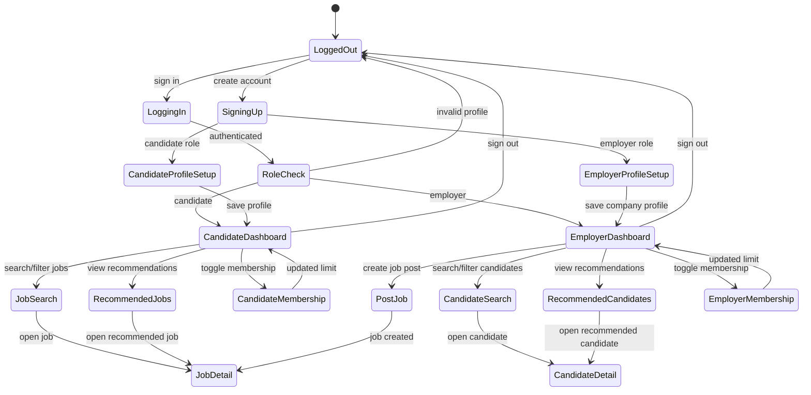
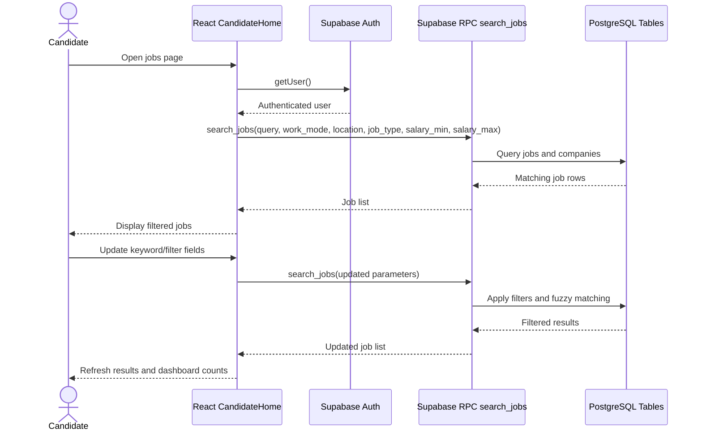
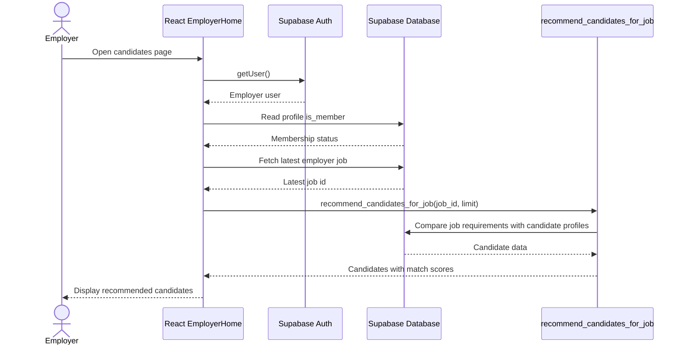

# Talent Match Development Document

## 1. Project Overview

### 1.1 Project Background

Talent Match is a web-based recruitment matching system designed to connect job candidates with employers more efficiently. The system supports two main user groups: candidates who want to find suitable jobs, and employers who want to find suitable candidates for their job postings. The project was developed as part of the CSIT314 software development process, with the second submission focusing on development progress, requirement changes, and how the team managed the project after the initial planning stage.

### 1.2 Problem Definition

Traditional job search platforms often require users to manually browse a large number of job posts or candidate profiles. This creates several problems:

- Candidates may miss suitable jobs because search results are too broad or not ranked by relevance.
- Employers may spend excessive time reviewing candidates who do not match the role requirements.
- Basic keyword search may not consider important matching factors such as skills, education, work mode, location, job type, salary range, or company information.
- Free and membership users may need different access levels for recommendation results.

Talent Match addresses these issues by combining structured profiles, job posting data, search filters, and recommendation logic.

### 1.3 System Objectives

The main objectives of the system are:

- Provide secure account creation and login for candidates and employers.
- Allow candidates to create and maintain profiles including education, skills, experience, preferred work mode, and preferred location.
- Allow employers to create company profiles and post jobs with required education, skills, experience, work mode, location, job type, and salary range.
- Recommend jobs to candidates and candidates to employers using matching scores.
- Support advanced search and filtering based on keyword, work mode, location, job type, salary range, skills, education, and experience.
- Provide a responsive and presentation-ready user interface for the second submission demonstration.
- Support membership-based recommendation limits, where free users receive top 10 recommendations and members receive unlimited recommendations.

### 1.4 Target Users

| User Group | Needs | Main System Functions |
| --- | --- | --- |
| Candidates | Find relevant jobs, manage career profile, compare job options | Candidate profile, job search, recommended jobs, job details, membership toggle |
| Employers | Find suitable candidates, manage company profile, publish roles | Employer profile, post job, candidate search, recommended candidates, candidate details, membership toggle |
| Project assessors/demo users | Evaluate requirements coverage and system quality | Demo data, clear UI, working search and recommendation flows |

## 2. Development Model

### 2.1 Adopted Agile Methodology

The team adopted an Agile development model with Scrum-inspired iteration planning. The project was divided into short development cycles, where each cycle focused on a small set of user-facing features or technical improvements. The original plan used staged development: authentication and user roles first, then profile management, then job posting, then recommendation and search features, followed by user interface refinement and testing.

For the second submission period, the team used a more flexible Kanban-style approach within the Agile model. This adjustment was made because new requirements were introduced after the initial planning stage, and several tasks needed to be reprioritised quickly.

### 2.2 Consistency With Original Plan

The overall execution remained consistent with the original plan in terms of major milestones:

- Authentication and role-based navigation were implemented before role-specific features.
- Candidate and employer profile features were implemented before matching logic.
- Job posting and job browsing were implemented before advanced search and recommendation enhancements.
- Testing and interface polishing were completed after the major functions were working.

However, the execution was adjusted after new requirements were identified for the second submission. The original plan focused mainly on basic matching and profile/job management. The second stage added more detailed filtering, membership limits, company information in search, salary range support, job type support, and improved dashboard-style pages.

### 2.3 Adjustments to Development Process

| Area | Original Plan | Adjustment During Second Stage | Reason |
| --- | --- | --- | --- |
| Sprint structure | Fixed feature stages | More flexible Kanban-style task flow | New requirements required faster reprioritisation |
| Search scope | Search by basic job/candidate data | Search expanded to company information, salary range, job type, work mode, and fuzzy matching | Rubric and requirement changes required more complete search coverage |
| Recommendation logic | Top 10 recommendations only | Recommendation limit based on membership status | New membership requirement |
| UI polish | Basic functional interface | Dashboard-style responsive interface | Improve demonstration quality and usability |
| Database schema | Basic profile, candidate, company, and job tables | Added membership, candidate preferences, job type, salary fields, and updated RPC functions | Support new business rules and filters |

### 2.4 Task Assignment Changes

The team initially divided work by feature area: frontend pages, Supabase database design, authentication, and documentation. During the second stage, task assignments changed to focus on requirement completion rather than only feature ownership. For example:

- Frontend work expanded from basic forms to dashboard layout, responsive design, filter panels, and match score display.
- Backend/database work expanded from table creation to updating stored procedures for recommendation and search.
- Testing work expanded from manual page checks to build/lint verification and demo data preparation.
- Documentation work shifted to describing requirement changes and development management, not only technical implementation.

> Replace this paragraph with actual team member names if your submission requires individual contribution details.

### 2.5 Tool Changes

The implementation used React, Vite, Supabase, and SQL migration scripts. The team used local project files for implementation tracking and documentation. No Git repository metadata is currently present in this local copy, so the final submission should include the actual GitHub repository link and version history evidence if available.

## 3. Development Progress

### 3.1 Progress From Week 8 to Final Submission

| Period | Planned Work | Completed Work | Notes |
| --- | --- | --- | --- |
| Week 8 | Complete role-based authentication and profile flows | Login, signup, protected routes, candidate profile, and employer profile were implemented | Users are redirected based on role |
| Week 9 | Implement job posting and browsing | Employers can post jobs; candidates can browse jobs and view details | Job data stored in Supabase |
| Week 10 | Implement matching and recommendation logic | Recommendation RPCs were created for jobs and candidates | Matching score uses skills, education, experience, work mode, and location |
| Week 11 | Add search and filtering | Candidate and job search functions were added with filters and fuzzy matching | Search uses Supabase SQL RPCs and `pg_trgm` |
| Week 12 | Handle new requirements and UI refinement | Added membership, job type, salary range, company information search, dashboard layout, match score display, and demo seed data | Adjusted priorities to satisfy second submission changes |
| Final stage | Testing and documentation | Build and lint checks were completed; project change summary and development document were prepared | Demo data script added for presentation |

### 3.2 Done Compared With Previous Plan

Compared with the first-stage plan, the following planned items were completed:

- User authentication using Supabase Auth.
- Candidate and employer role separation.
- Candidate profile management.
- Employer company profile management.
- Job posting by employers.
- Job browsing and job detail pages.
- Candidate browsing and candidate detail pages.
- Recommendation logic for both candidates and employers.
- Search and filter functions for jobs and candidates.
- Database schema and row-level security policies.

The following items were extended beyond the previous plan:

- Membership-based recommendation limits.
- Job type and salary range fields.
- Candidate preference fields such as preferred work mode and preferred location.
- Company information included in job search.
- Fuzzy keyword matching using PostgreSQL trigram similarity.
- Dashboard-style UI improvements and responsive layouts.
- Demo seed data for testing and presentation.

### 3.3 New Requirements Added

New requirements were added during the later development stage, mainly after the basic job and candidate flows were already working. These requirements included:

- More detailed job filters, including job type and salary range.
- Search that considers company profile information.
- Membership behaviour that limits free users to top 10 recommendations.
- Match score display on recommendation cards.
- Improved dashboard-style interface for demonstration quality.
- Demo data to support a realistic final presentation.

### 3.4 Priority Adjustment

The team adjusted priorities based on requirement impact:

1. High priority: schema changes and RPC updates, because frontend filters and recommendation limits depended on backend support.
2. High priority: candidate and employer search flows, because they directly affected core system usefulness.
3. Medium priority: UI polish, because it improved usability and demonstration quality but depended on working data flows.
4. Medium priority: demo data, because it supported testing and presentation after features were stable.
5. Lower priority: optional visual enhancements that did not affect requirement coverage.

## 4. Change Management Progress

### 4.1 Change Identification

During the second development stage, the team reviewed the project against the second submission requirements and identified gaps between the existing implementation and expected system behaviour. The main gaps were:

- Job search did not yet support job type and salary range.
- Job search needed to include company profile information.
- Recommendation output needed clearer match score visibility.
- Membership rules needed to affect recommendation limits.
- The UI needed to be more polished for practical use and demonstration.

### 4.2 Impact Analysis

| Change | Frontend Impact | Backend/Database Impact | Risk | Resolution |
| --- | --- | --- | --- | --- |
| Add job type | Add field in job posting, job cards, job detail, and filters | Add `job_type` column and update `search_jobs` RPC | Existing jobs may not have a type | Defaulted to `Full-time` |
| Add salary range | Add min/max salary fields and filters | Add `salary_min`, `salary_max`; update search logic | Null salary values may affect filtering | SQL handles null salary as flexible |
| Search company information | No major UI change beyond keyword search | Join jobs with companies in `search_jobs` | Search performance and SQL complexity | Used SQL RPC and selected relevant fields |
| Membership recommendation limit | Add membership toggle and status display | Add `is_member` to profiles and `p_limit` to recommendation RPCs | Inconsistent limits across roles | Candidate and employer pages both apply membership limit |
| Candidate preference matching | Add profile fields for work mode and location | Add fields to candidates table and update recommendation score | Existing candidates may have missing values | Defaults and nullable fields used |
| UI dashboard improvement | Update global CSS and page layouts | No database impact | Layout regressions on small screens | Responsive CSS and card grid layout |

### 4.3 Technical Adjustments

The main technical changes were:

- Added database migration `20260521000000_job_salary_type_and_search.sql`.
- Added `job_type`, `salary_min`, and `salary_max` to the `jobs` table.
- Updated `recommend_jobs_for_candidate` to return new job fields and calculate score using skills, experience, education, work mode, and location.
- Updated `search_jobs` to search across job title, description, location, required skills, job type, company name, and company information.
- Added salary range filtering logic.
- Added `is_member` to `profiles` in an earlier migration.
- Updated frontend pages to call new RPC parameters.
- Updated job and candidate cards to show match scores when returned.
- Added `seed_demo_jobs.sql` to support presentation testing.

These changes align with the Technical Document because they affect the database schema, backend RPC functions, frontend forms, search APIs, and UI behaviour.

### 4.4 Change Control Process

The team followed this process when handling changes:

1. Review requirement gap against the second submission rubric.
2. Identify whether the change affects frontend, backend, database, or documentation.
3. Update database migrations first when new data fields are required.
4. Update Supabase RPC functions to expose the required data and business logic.
5. Update React pages and components to collect, display, and filter the new data.
6. Run build and lint checks.
7. Add demo data or documentation updates where needed.

### 4.5 Result of Change Management

The change management process allowed the team to add new functionality without replacing the existing architecture. Most changes extended the existing tables, stored procedures, and React pages rather than creating separate systems. This reduced the risk of breaking core flows such as login, profile management, and job browsing.

## 5. System Analysis and Design

This section focuses on changed analysis and design elements required for the second submission. The technical details should be expanded in the separate Technical Document.

### 5.1 Changed UML State Diagram

The following state diagram shows the updated user flow after adding membership, advanced search, and recommendation features.

### 5.2 Changed UML Sequence Diagram: Candidate Job Search

### 5.3 Changed UML Sequence Diagram: Employer Recommendation Flow

### 5.4 Key Design Changes

The second stage design changes were mainly extensions to the original architecture:

- The profile model was extended with membership status.
- The candidate model was extended with work experience, preferred work mode, and preferred location.
- The job model was extended with job type and salary range.
- Recommendation functions were updated to use more matching factors.
- Search functions were updated to support broader keyword matching and additional filters.
- The UI was reorganised around candidate and employer dashboards.

## 6. Meeting Records

> Replace the sample rows below with your team's real meeting records before final submission.

| Date | Meeting Topic | Key Decisions | Task Assignments |
| --- | --- | --- | --- |
| Week 8 meeting | Review first-stage implementation and second-stage priorities | Continue with Agile iteration; complete core profile and job flows first | Frontend: profile/job pages; Backend: database tables and policies |
| Week 9 meeting | Job posting and recommendation planning | Use Supabase RPC functions for recommendation logic | Backend: recommendation SQL; Frontend: recommendation cards |
| Week 10 meeting | Search requirement review | Add keyword and filter search for both jobs and candidates | Backend: search RPCs; Frontend: filter forms |
| Week 11 meeting | New requirement impact analysis | Add membership, job type, salary range, and company search | Backend: migrations; Frontend: form and display updates |
| Week 12 meeting | Demo preparation and quality review | Improve dashboard UI, add demo seed data, verify build and lint | UI: responsive layout; Testing: build/lint; Documentation: final documents |

## 7. Summary

During the second submission stage, the project moved from a basic recruitment matching prototype to a more complete system with role-based dashboards, advanced search, recommendation scores, membership-based limits, and improved database support. The team kept the original Agile direction but adjusted the execution style to handle new requirements quickly. Most changes were integrated by extending the existing React and Supabase architecture, which helped preserve working features while improving requirement coverage.

Before final submission, the remaining documentation tasks are:

- Replace sample meeting records with actual dates, names, and decisions.
- Add real team member responsibility details if required.
- Insert screenshots or exported images of the Mermaid UML diagrams if the final format is Word/PDF.
- Add the final GitHub repository link and version history evidence if available.
